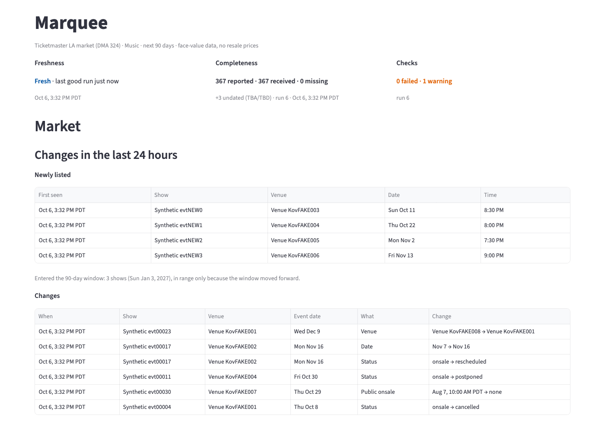
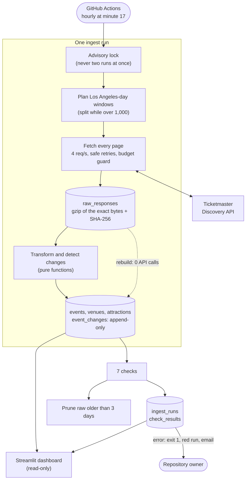
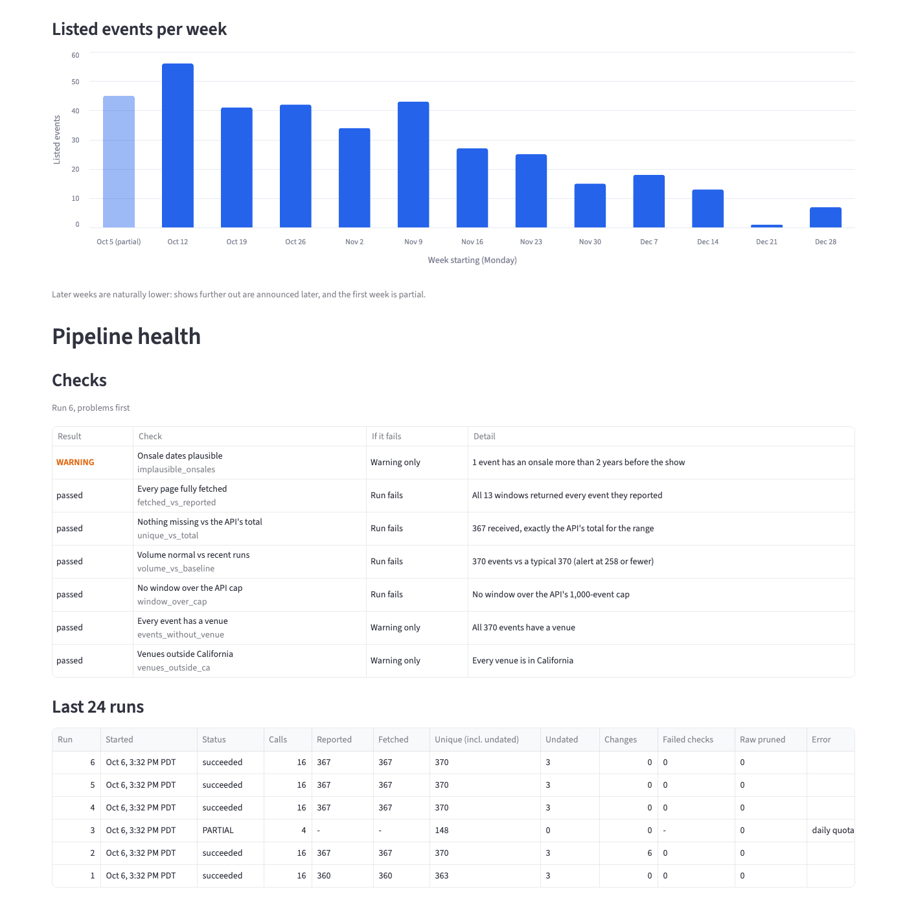

# Marquee

Marquee pulls the next 90 days of Los Angeles music events from the official Ticketmaster Discovery API every hour, keeps every response exactly as received, and turns them into clean Postgres tables. It checks its own work after every run and shows on a dashboard whether the data is fresh, complete and trustworthy right now.



*Synthetic data. These screenshots were made with `scripts/demo_seed.py`, which runs the real pipeline against the test suite's fake API (invented shows, venues and dates). They contain no real Ticketmaster data, in line with this repository's rule: never commit real API data.*

## At a glance

Real numbers from production on 2026-10-06, Ticketmaster's LA market (DMA 324), Music, next 90 days.

| | |
|---|---|
| **Paging cap, brute force:** one search, paged to the end | **1,200 of 1,282** events; 82 lost (6.4%), because page 6 returns HTTP 400 `DIS1035` |
| **Paging cap, windowed:** Los Angeles-day windows, split while over 1,000 | **1,282 of 1,282**; unique event IDs equal the API's own total |
| **Raw storage per run** | **1.84 MB** as gzip of the exact bytes, against **6.32 MB** as `jsonb`, which isn't even byte-exact |
| **One run** | 16 API calls (13 windows, 1 whole-range total, 2 undated calls), about 20 s |
| **A day, hourly** | 384 calls (budget 2,500; quota 5,000) and about 131 MB of raw kept at 3-day retention (budget 500 MB of Neon's free 1 GB) |
| **Rebuild from raw** | 0 API calls; `rebuild --verify` found 0 differences |
| **Tests** | 390: unit tests, plus integration tests against Postgres 18, plus the Streamlit app run headless |
| **Checks** | 7 after every run: 4 can fail the run, 3 are warnings |
| **Scheduled runs on GitHub Actions** | run 6: _pending_ · run 7: _pending_ |

## Run it on a Mac

You need [Docker Desktop](https://www.docker.com/products/docker-desktop/) running, [uv](https://docs.astral.sh/uv/) (`brew install uv`), and a free Ticketmaster API key: create an app at [developer.ticketmaster.com](https://developer.ticketmaster.com/) and copy its **Consumer Key**.

From the repository root:

```sh
cp .env.example .env                    # then paste your key after TM_API_KEY=
docker compose up -d --wait             # Postgres 18 on localhost:55432
uv run python -m marquee migrate        # create the tables (uv installs Python 3.12 and the dependencies first)
uv run python -m marquee ingest         # one real run: about 20 s and 16 API calls
uv run streamlit run dashboard/app.py   # the dashboard, at http://localhost:8501
```

- **Run Streamlit from the repository root.** It reads its theme and toolbar settings from `.streamlit/config.toml` in the current folder.
- **The checks:** `uv run pytest` (the integration tests use the container's `marquee_test` database), `uv run ruff check`, `uv run mypy`.
- **More commands:**
  - `python -m marquee checks` reports the latest run's checks.
  - `python -m marquee rebuild --verify` rebuilds into a throwaway schema and compares, with no API calls.
  - `python -m marquee prune --dry-run` shows what retention would delete.
- **A container from before** `docker/initdb/` existed has only `marquee_test`. Run `docker compose down -v`, then `up` again.

## How it works



**One run, step by step:**
1. Take a Postgres advisory lock.
2. Open an `ingest_runs` row, recording the range it covers.
3. Plan weekly windows in Los Angeles days. Halve any window whose first page reports more than 1,000 events.
4. Fetch every page, then make two calls for undated (TBA/TBD) events. **Each page is one transaction:** save the raw bytes, transform them, record field changes, upsert. A run that stops halfway is safe to re-run.
5. Run the checks.
6. Prune old raw.
7. Close the run as `succeeded`, `partial` or `failed`.

The details are in [docs/PLAN.md](docs/PLAN.md).

## Design rules

1. **Raw first, clean second.** The transform reads only stored raw, never the API. So a parsing fix is replayed from raw with zero API calls ([decision 001](docs/decisions/001-raw-first.md)).
2. **Our own IDs, plus `(source, source_id)`.** A second marketplace would mean new rows, not a redesign ([decision 002](docs/decisions/002-own-ids.md)).
3. **Re-running never duplicates.** Every write is an upsert on the source's key.
4. **Silence becomes loud.** Every window records what the API said exists next to what we received, and the checks compare them.
5. **Pure core, I/O at the edges.** Windows, transform, change detection, checks and dashboard formatting are pure functions with no network or database. Only the client, loader and queries touch the outside world.
6. **Boring tools,** with written triggers for upgrading: Python, Postgres (Neon) and a scheduler ([decision 003](docs/decisions/003-boring-stack-and-schedule.md)).
7. **A read-only dashboard.** Every dashboard connection is read-only from the moment it opens, with a 5 s statement timeout. Colour never stands alone: every problem has a word (FAILED, WARNING, PARTIAL, LATE, STALE, CANCELLED).

## Checks

They run after every complete run. Two counts may differ by up to max(2 events, 1%), because the API's totals drift by a few events an hour.

| Check | If it fails | What it catches |
|---|---|---|
| Every page fully fetched (`fetched_vs_reported`) | Run fails | Each window returned the events it reported: paging bugs, dropped pages |
| Nothing missing vs the API's total (`unique_vs_total`) | Run fails | Unique IDs across all windows equal the API's total for the whole range: gaps between windows |
| No window over the API cap (`window_over_cap`) | Run fails | A day with more than 1,000 events, which we know we couldn't fetch |
| Volume normal vs recent runs (`volume_vs_baseline`) | Run fails | Fewer than 70% of the typical count (the median of the last 7 good runs): a source quietly returning less |
| Every event has a venue (`events_without_venue`) | Warning only | Upstream data gaps |
| Venues outside California (`venues_outside_ca`) | Warning only | Out-of-area venues in the LA market: 2 in Canada today |
| Onsale dates plausible (`implausible_onsales`) | Warning only | Any onsale set aside for a reason other than Ticketmaster's known 1900 placeholder |

## The alert path

1. **`ingest` exits 1 for any bad run:** `partial` (budget or quota ran out), `failed`, or an error-level check failed.
2. **So the scheduled GitHub Actions run turns red,** and GitHub notifies the user who last changed the workflow's cron line.
3. **To get that as an email,** go to github.com/settings/notifications → **System** → **Actions**, choose **Email**, tick **Only notify for failed workflows**, and save.
4. **Warnings don't fail the run;** they show on the dashboard.
5. **A schedule that stops is silent:** no run means no red run. The dashboard's freshness is the backstop: **LATE** after 1.5 schedule intervals, **STALE** after 3.

## Data retention and Ticketmaster's terms

Ticketmaster's terms of use say you may not "cache or store any Event Content other than for reasonable periods in order to provide the service you are providing" ([Licensed Uses and Restrictions](https://developer.ticketmaster.com/support/terms-of-use/)). So:

- **Raw responses are kept for `RAW_RETENTION_DAYS` (3 days)** and pruned at the end of every run, never beyond 14 days. The latest good run's raw is always kept, so a rebuild is possible.
- **Nothing real is committed.** Real sample responses live in `local/` (gitignored). Test fixtures and these screenshots are synthetic: the same shape, invented values.
- **Personal and non-commercial.** If the dashboard is ever hosted, it stays private.

## Honest limits

- **Face-value data only, and in practice no prices at all.** Resale marketplaces have no public API. Ticketmaster's `priceRanges` was missing on all 1,200 events checked, so Marquee stores no prices.
- **One market.** Ticketmaster's LA market (DMA 324), Music, the next 90 days. That market reaches Palm Springs and San Luis Obispo, and tags 2 venues in Canada (the warning above).
- **GitHub's scheduler is best-effort.** Scheduled runs can be delayed at busy times, which is why the cron is minute 17 rather than the top of the hour. On a public repository, schedules are disabled after 60 days without repository activity, and that's silent: only the dashboard's STALE shows it.
- **A read-only session, not a SELECT-only role.** The dashboard can't change data by accident, but a hostile query could switch the session back. If it's ever hosted, a SELECT-only database role is the stronger guard.
- **The clean tables aren't pruned.** Raw ages out after 3 days, but past events stay in `events` with their first and last sighting.
- **Rebuild only reaches back 3 days,** because that's all the raw that's kept ([decision 001](docs/decisions/001-raw-first.md) lists what it can't reproduce).
- **Only five fields are tracked as changes:** status, date, time, venue and public onsale. A renamed show just shows its new name.
- **The Neon compute figure is an estimate:** 16–32 CU-hours a month of the free 100. Neon's console has the real number.

## What I'd build next

1. **A dead-man's switch.** An outside heartbeat that alerts when there's been no good run for 3 hours, because a disabled schedule never fails loudly.
2. **A SELECT-only role and private hosting** for the dashboard.
3. **Prune past events** from the clean tables some weeks after their date, to match the spirit of the retention rule.
4. **Store a raw page only when its hash changes** ([decision 005](docs/decisions/005-raw-storage.md)), for a longer rebuild window in the same storage.
5. **A second source** through `(source, source_id)`, with a mapping table to match the same show across marketplaces.
6. **A daily digest of warnings,** so they don't depend on someone opening the dashboard.



*Synthetic data, as above.*

## Repository map

```
src/marquee/       the pipeline: tm_client, windows, fetch, transform, changes, load,
                   ingest, checks, rebuild, prune; queries and present for the dashboard
dashboard/app.py   the Streamlit dashboard, layout only
migrations/        SQL schema, applied in order and checksummed
tests/             390 tests; fixtures and the fake API are synthetic
scripts/           demo_seed.py, synthetic data for the screenshots
docs/              PLAN.md, STATUS.md (real numbers, newest first), api-notes.md, decisions/
.github/workflows/ ci.yml (ruff, mypy strict, pytest on Postgres 18), ingest.yml (hourly)
```
